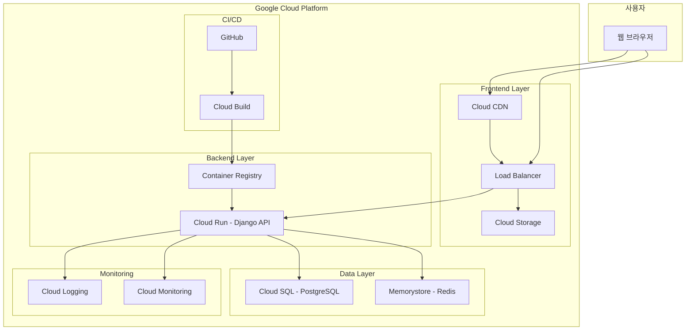

# 구글 클라우드 배포 설계

## 개요

치과 추천 AI 시스템을 Google Cloud Platform에 배포하기 위한 상세한 아키텍처 설계입니다. 마이크로서비스 아키텍처를 기반으로 하여 확장성, 안정성, 보안성을 보장합니다.

## 아키텍처

### 전체 시스템 아키텍처



### 네트워크 아키텍처

1. **프론트엔드 트래픽 플로우**
   - 사용자 → Cloud CDN → Load Balancer → Cloud Storage
   - HTTPS 강제, SSL 인증서 자동 관리

2. **백엔드 API 트래픽 플로우**
   - 사용자 → Load Balancer → Cloud Run → Cloud SQL/Redis
   - 내부 네트워크를 통한 보안 통신

3. **CI/CD 플로우**
   - GitHub → Cloud Build → Container Registry → Cloud Run
   - 자동 빌드 및 배포 파이프라인

## 컴포넌트 및 인터페이스

### 1. 프론트엔드 (React)

**기술 스택:**
- React 18 + Vite
- TypeScript (선택사항)
- Styled Components
- React Router

**배포 구성:**
```dockerfile
# Frontend Dockerfile
FROM node:18-alpine AS builder
WORKDIR /app
COPY package*.json ./
RUN npm ci --only=production
COPY . .
RUN npm run build

FROM nginx:alpine
COPY --from=builder /app/dist /usr/share/nginx/html
COPY nginx.conf /etc/nginx/nginx.conf
EXPOSE 80
CMD ["nginx", "-g", "daemon off;"]
```

**환경 변수:**
- `VITE_API_URL`: 백엔드 API URL
- `VITE_ENVIRONMENT`: 배포 환경 (production)

### 2. 백엔드 (Django)

**기술 스택:**
- Django 4.2 + Django REST Framework
- PostgreSQL (psycopg2)
- Redis (django-redis)
- Gunicorn (WSGI 서버)

**배포 구성:**
```dockerfile
# Backend Dockerfile
FROM python:3.11-slim AS builder
WORKDIR /app
COPY requirements.txt .
RUN pip install --no-cache-dir -r requirements.txt

FROM python:3.11-slim
WORKDIR /app
COPY --from=builder /usr/local/lib/python3.11/site-packages /usr/local/lib/python3.11/site-packages
COPY . .
EXPOSE 8000
CMD ["gunicorn", "--bind", "0.0.0.0:8000", "config.wsgi:application"]
```

**환경 변수:**
- `DATABASE_URL`: Cloud SQL 연결 문자열
- `REDIS_URL`: Memorystore Redis URL
- `SECRET_KEY`: Django 시크릿 키
- `DEBUG`: False (프로덕션)
- `ALLOWED_HOSTS`: 허용된 호스트 목록

### 3. 데이터베이스 (Cloud SQL)

**구성:**
- **엔진**: PostgreSQL 15
- **인스턴스 타입**: db-f1-micro (개발용) → db-n1-standard-1 (프로덕션)
- **스토리지**: 20GB SSD (자동 확장 가능)
- **백업**: 매일 자동 백업, 7일 보관
- **고가용성**: 리전 내 다중 영역 배포

**보안 설정:**
- Private IP 사용
- SSL 연결 강제
- 인증된 네트워크만 접근 허용

### 4. 캐시 (Memorystore Redis)

**구성:**
- **버전**: Redis 7.0
- **인스턴스 타입**: Basic (1GB) → Standard (고가용성)
- **네트워크**: VPC 내부 통신
- **용도**: 세션 관리, API 응답 캐싱, 검색 결과 캐싱

## 데이터 모델

### 데이터베이스 스키마

기존 Django 모델 유지:
- `Clinic`: 치과 정보
- `Review`: 리뷰 데이터
- `SentimentAnalysis`: 감성 분석 결과
- `PriceData`: 가격 정보
- `User`: 사용자 계정

### 캐시 전략

```python
# Redis 캐시 키 구조
CACHE_KEYS = {
    'clinic_list': 'clinics:list:{district}:{treatment}:{page}',
    'clinic_detail': 'clinic:detail:{clinic_id}',
    'price_comparison': 'price:comparison:{district}:{treatment}',
    'search_results': 'search:{query_hash}',
    'user_session': 'session:{user_id}',
}

# 캐시 TTL (Time To Live)
CACHE_TTL = {
    'clinic_list': 300,      # 5분
    'clinic_detail': 600,    # 10분
    'price_comparison': 1800, # 30분
    'search_results': 300,   # 5분
    'user_session': 3600,    # 1시간
}
```

## 에러 처리

### 1. 애플리케이션 레벨

**Django 에러 처리:**
```python
# settings/production.py
LOGGING = {
    'version': 1,
    'disable_existing_loggers': False,
    'handlers': {
        'cloud_logging': {
            'class': 'google.cloud.logging.handlers.CloudLoggingHandler',
            'client': google.cloud.logging.Client(),
        },
    },
    'root': {
        'handlers': ['cloud_logging'],
        'level': 'INFO',
    },
}
```

**React 에러 처리:**
```javascript
// Error Boundary 컴포넌트
class ErrorBoundary extends React.Component {
  componentDidCatch(error, errorInfo) {
    // Cloud Logging으로 에러 전송
    console.error('React Error:', error, errorInfo);
  }
}
```

### 2. 인프라 레벨

**Cloud Run 헬스 체크:**
```python
# Django 헬스 체크 엔드포인트
@api_view(['GET'])
def health_check(request):
    try:
        # 데이터베이스 연결 확인
        from django.db import connection
        connection.ensure_connection()
        
        # Redis 연결 확인
        from django.core.cache import cache
        cache.set('health_check', 'ok', 10)
        
        return Response({'status': 'healthy'})
    except Exception as e:
        return Response({'status': 'unhealthy', 'error': str(e)}, 
                       status=500)
```

## 테스트 전략

### 1. 단위 테스트

**백엔드 테스트:**
```python
# pytest 설정
# conftest.py
@pytest.fixture
def api_client():
    return APIClient()

@pytest.fixture
def test_clinic():
    return Clinic.objects.create(
        name='테스트 치과',
        district='강남구',
        address='서울시 강남구 테스트로 123'
    )
```

**프론트엔드 테스트:**
```javascript
// Jest + React Testing Library
import { render, screen } from '@testing-library/react';
import ClinicCard from './ClinicCard';

test('renders clinic information', () => {
  const clinic = {
    name: '테스트 치과',
    district: '강남구',
    average_rating: 4.5
  };
  
  render(<ClinicCard clinic={clinic} />);
  expect(screen.getByText('테스트 치과')).toBeInTheDocument();
});
```

### 2. 통합 테스트

**API 통합 테스트:**
```python
class ClinicAPITestCase(APITestCase):
    def test_clinic_search(self):
        response = self.client.get('/api/clinics/search/', {
            'district': '강남구',
            'treatment': '스케일링'
        })
        self.assertEqual(response.status_code, 200)
        self.assertIn('results', response.data)
```

### 3. E2E 테스트

**Playwright 설정:**
```javascript
// e2e/clinic-search.spec.js
import { test, expect } from '@playwright/test';

test('사용자가 치과를 검색할 수 있다', async ({ page }) => {
  await page.goto('/');
  await page.selectOption('[name="district"]', '강남구');
  await page.selectOption('[name="treatment"]', '스케일링');
  await page.click('button:has-text("치과 찾기")');
  
  await expect(page.locator('.clinic-card')).toBeVisible();
});
```

## 보안 고려사항

### 1. 네트워크 보안

- **VPC**: 모든 리소스를 VPC 내부에 배치
- **방화벽 규칙**: 필요한 포트만 개방
- **Private IP**: 데이터베이스는 Private IP만 사용
- **SSL/TLS**: 모든 통신 암호화

### 2. 애플리케이션 보안

```python
# Django 보안 설정
SECURE_SSL_REDIRECT = True
SECURE_HSTS_SECONDS = 31536000
SECURE_HSTS_INCLUDE_SUBDOMAINS = True
SECURE_HSTS_PRELOAD = True
SECURE_CONTENT_TYPE_NOSNIFF = True
SECURE_BROWSER_XSS_FILTER = True
X_FRAME_OPTIONS = 'DENY'
```

### 3. 데이터 보안

- **암호화**: 저장 데이터 및 전송 데이터 암호화
- **접근 제어**: IAM을 통한 세밀한 권한 관리
- **감사 로그**: 모든 데이터 접근 로그 기록

## 성능 최적화

### 1. 프론트엔드 최적화

```javascript
// Vite 빌드 최적화
export default defineConfig({
  build: {
    rollupOptions: {
      output: {
        manualChunks: {
          vendor: ['react', 'react-dom'],
          router: ['react-router-dom'],
          ui: ['styled-components']
        }
      }
    }
  }
});
```

### 2. 백엔드 최적화

```python
# Django 쿼리 최적화
class ClinicListView(ListAPIView):
    def get_queryset(self):
        return Clinic.objects.select_related(
            'district'
        ).prefetch_related(
            'reviews__sentimentanalysis'
        ).annotate(
            avg_rating=Avg('reviews__original_rating')
        )
```

### 3. 캐싱 전략

```python
# Redis 캐싱 데코레이터
from django.core.cache import cache

def cache_result(key_pattern, timeout=300):
    def decorator(func):
        def wrapper(*args, **kwargs):
            cache_key = key_pattern.format(**kwargs)
            result = cache.get(cache_key)
            if result is None:
                result = func(*args, **kwargs)
                cache.set(cache_key, result, timeout)
            return result
        return wrapper
    return decorator
```

## 모니터링 및 알림

### 1. 메트릭 수집

```yaml
# Cloud Monitoring 알림 정책
alertPolicy:
  displayName: "High Error Rate"
  conditions:
    - displayName: "Error rate > 5%"
      conditionThreshold:
        filter: 'resource.type="cloud_run_revision"'
        comparison: COMPARISON_GREATER_THAN
        thresholdValue: 0.05
  notificationChannels:
    - "projects/PROJECT_ID/notificationChannels/CHANNEL_ID"
```

### 2. 로그 분석

```python
# 구조화된 로깅
import structlog

logger = structlog.get_logger()

def clinic_search_view(request):
    logger.info(
        "clinic_search_requested",
        district=request.GET.get('district'),
        treatment=request.GET.get('treatment'),
        user_id=request.user.id if request.user.is_authenticated else None
    )
```

## 배포 전략

### 1. Blue-Green 배포

```yaml
# cloudbuild.yaml
steps:
  - name: 'gcr.io/cloud-builders/docker'
    args: ['build', '-t', 'gcr.io/$PROJECT_ID/dental-ai:$BUILD_ID', '.']
  
  - name: 'gcr.io/cloud-builders/docker'
    args: ['push', 'gcr.io/$PROJECT_ID/dental-ai:$BUILD_ID']
  
  - name: 'gcr.io/cloud-builders/gcloud'
    args: [
      'run', 'deploy', 'dental-ai',
      '--image', 'gcr.io/$PROJECT_ID/dental-ai:$BUILD_ID',
      '--platform', 'managed',
      '--region', 'asia-northeast3',
      '--no-traffic'
    ]
  
  - name: 'gcr.io/cloud-builders/gcloud'
    args: [
      'run', 'services', 'update-traffic', 'dental-ai',
      '--to-revisions', 'LATEST=100',
      '--region', 'asia-northeast3'
    ]
```

### 2. 롤백 전략

```bash
# 이전 버전으로 롤백
gcloud run services update-traffic dental-ai \
  --to-revisions=dental-ai-00001-abc=100 \
  --region=asia-northeast3
```

이 설계 문서는 구글 클라우드 배포를 위한 포괄적인 아키텍처와 구현 방안을 제시합니다. 다음 단계에서는 이를 바탕으로 구체적인 구현 작업을 진행하겠습니다.